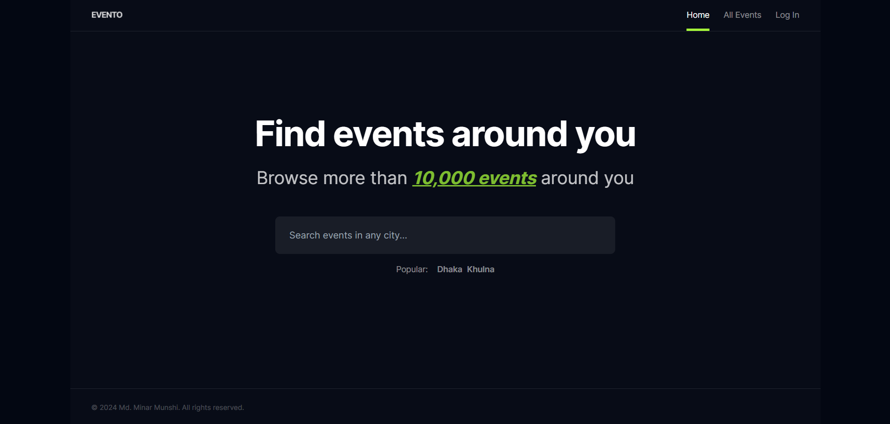

# Events Web App

## Description

The Events Web App is a full-stack application built with **Next.js** and
**MongoDB** that allows users to view ongoing events and purchase tickets.
Administrators have the ability to add new events and manage ticket sales,
providing a comprehensive platform for event management.

## Features

- **User Features:**
  - Browse and view ongoing events.
  - Purchase tickets for events.
- **Admin Features:**
  - Add new events.
  - Manage existing events.

## Technologies Used

- Next.js
- Tailwind CSS (for styling)
- Mongoose
- MongoDB (for database)
- EdgeStore (for store the event poster)

## Dummy User Accounts

To test the application, you can use the following dummy user accounts:

- **Normal User:**
  - Email: demo@user.com
  - Password: 123456
- **Admin User:**
  - Email: demo@admin.com
  - Password: 654321
